# iiko
## Установка плагина
- Скопируйте папку LoonaPluginSettings в C:\ProgramData 

- Скопируйте папку LoonaPlugin (и iikoWaiter5 при необходимости) в директорию iikoFront/Plugins (в нашем случае C:\Program Files\iiko\iikoRMS\Front.Net\Plugins)

- Пройдите в свойства папки, зайдите в Безопасность, и дайте полный контроль Пользователю с которого вы заходите в систему

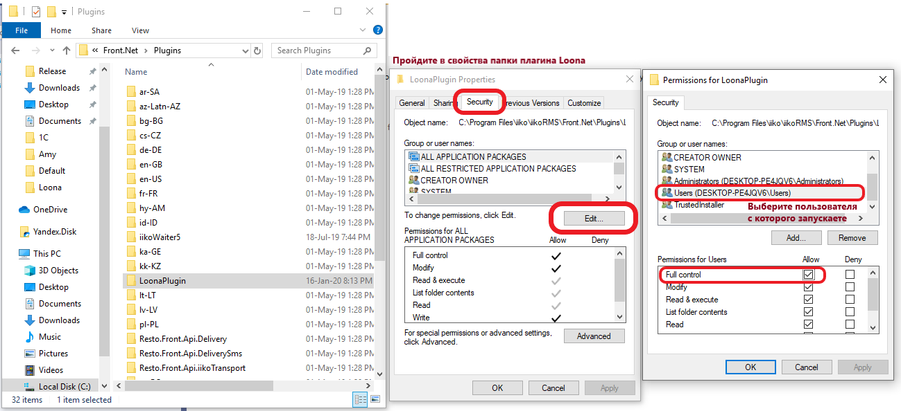

- Запускаем iiko Front (помним что для данного метода необходима лицензия типа iikoFrontPaymentPlugin)

## Создание Скидки

- Открываем iiko Office
    - Переходим в раздел Дисконтная Система -> Скидки и Надбавки
    - Добавляем скидку
    - Пишем свои названия скидок как показано ниже, они будут использованы в настройках плагина
    - Тип скидки ставим Скидки и Надбавки
    - Нажимаем Далее

- Убираем галочку "Можно назначить вручную", остальное по усмотрению ресторана

- Тип ставим “Процент” и назначаем процент данной скидки

- Нажимаем Далее и заканчиваем установку скидки.

- **Повторяем добавление скидки со всеми имеющимся уровнями скидок**

## Создание Купона

Для создания купона пройдите все пункты для создания скидки, но измените указаный процент скидки на 100%.

## Создание Бонуса или Подарочного сертификата

- Добавляем внешний вид оплаты. Переходим в раздел “Розничные продажи”  нажимаем на “Тип платы” и добавляем новую оплату. 

- Обязательно указываем данные так же: 

    - Наименование - LoonaPayment 
    - Тип - Внешний тип оплаты  
    - Название в чеке - Электронная карта 
    - Безналичный тип - LoonaPayment

- Сохраняем

## Настройки плагина

- Открываем Браузер

- Заходим на http://localhost:1234/settings

- Задаем настройки:
   - Api access token - доступен после создания сканера в кабинете (подробнее в разделе настройки кабинета) или по запросу от поддержки компании Loona
   - Api base url - https://api.loona.ai 
   - Plugin url - http://localhost  
   - Waiter port - 1234
   - Update URL - https://storage.yandexcloud.net/loona-common/loona-plugin/
 
- Далее заполняем детали всех имеющихся уровней скидок в кабинете, и **называем их так же как названы соответствующие уровни скидок в iiko office**

- Устанавливаем мобильное приложение iikoWaiter5 если нужно

## Активация сканирования в iiko waiter

- Зайдите в localhost:8100/settings через браузер

- Пройдите к "Loyalty System Integration Settings"

- Задайте настройки:
    - Loyalty plugin address: localhost:1234/api/op
    - Отметьте "галочкой" Is External Loyalty Enabled

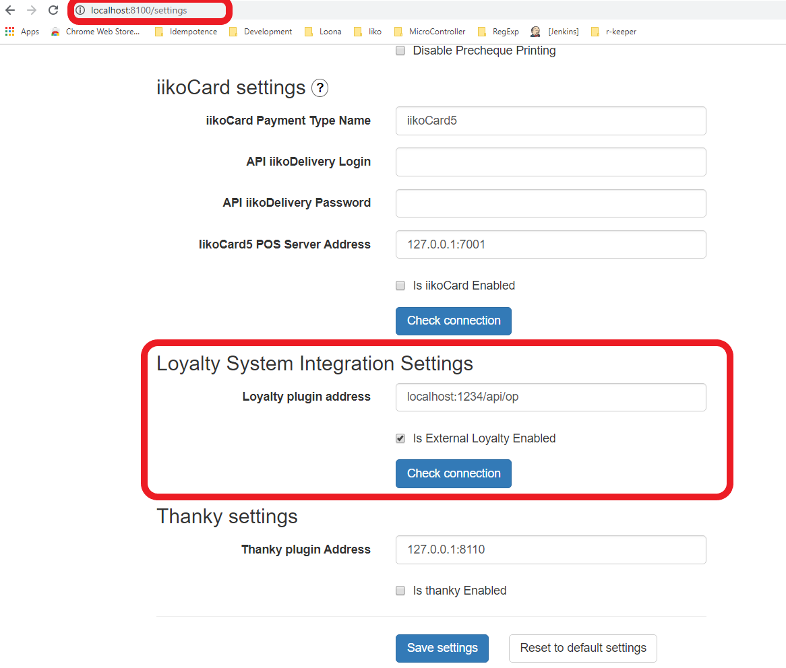

- Сохраните настройки

*Если не можете зайти в настройки по ссылке выше*:

- Зайдите в кассу

- Нажмите на "Дополнения" и затем на "iikoWaiter Настройки"

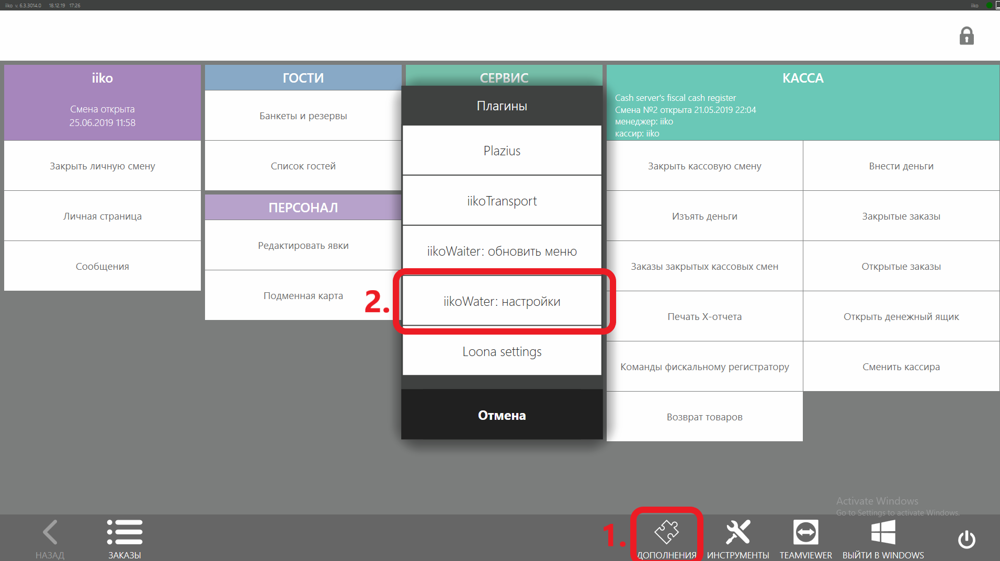

- Откроется QR код, отсканируйте его и пройдите по ссылке

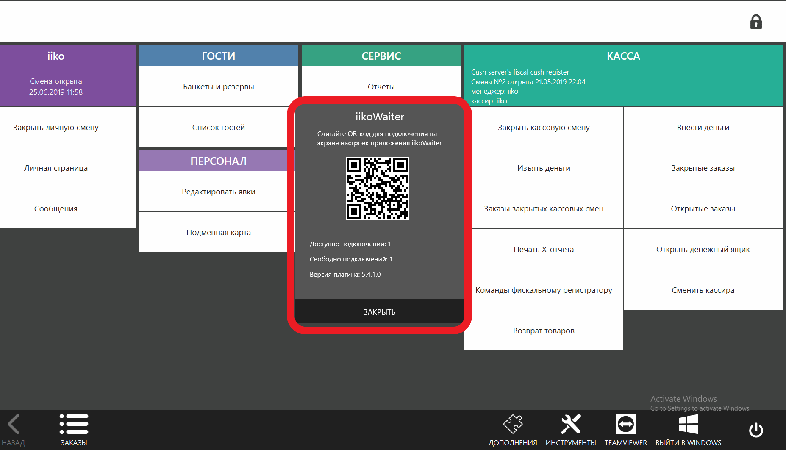

## Активация 2D канера

- Заходим в раздел Сотрудники -> Сотрудники и добавляем сотрудника

- Обязательно введите имя сотрудника "Loona"

- Ставим галочку "Только для плагинов"

- Ставим галочку на "Сотрудник"

- Добавляем должность - "Системный Администратор"

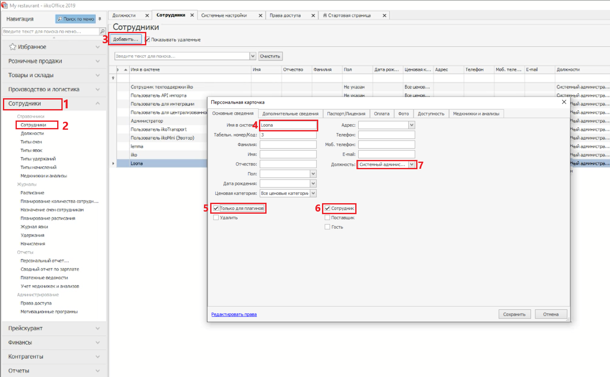

- Далее, пройдите в секцию "Дополнительные сведения"

- Обязательно введите ПИН-код: **1945**

- Сохраните изменения

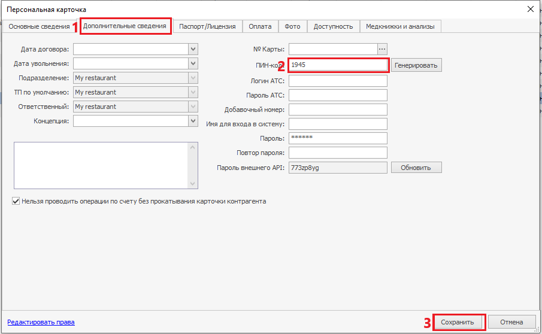

- Перезагрузите кабинет

## Настройки в кабинете

### Редактирование макета:

**Для использования скидок, подарочных сертификатов и бонусов** в системе iiko штрихкод на карте должен содержать Номер Карты. Для настройки штрихкода на Номер Карты:

- Зайдите в ваш личный кабинет Loona

- Перейдите в раздел **Макеты**

- Зайдите в  **редактирование** того макета на который хотите настроить сканер

- Перейдите в секцию **Дизайн**

- Нажмите на штрихкод, в настройках поля откроются настройки штрихкода

- Поменяйте значение на **Номер Карты**

**Для использования купона:**

- В значении штрихкода поменять значение на “своё значение”

- Поменять своё значение на ${pid}/№Продукт, где “№Продукт” это номер под которым позиция (блюдо) зарегистрирована в iikoOffice.

- Использовать карты Loona

## Создание API token сканера для карты

Для интеграции с системой iiko вам необходимо создать сканер в кабинете Loona и использовать его токен доступа. 

Для создания нового сканера:

- Зайдите в ваш личный кабинет Loona

- В разделе Сканер нажмите на Создать сканер.

- Введите название нового сканера

- Выберите тип сканера - "App".

- Выберите макеты с картами которые предназначены для сканирования, или отметьте Получить полный доступ чтобы сканер работал со всеми вашими макетами.

- Нажмите Создать

В списке созданных сканеров появится новый сканер со своим **токеном доступа** (Идентификационный номер), этот номер используется при настройке плагина.

# r_keeper

## Установка плагина

Перед установкой нобходимо:

- Убедиться в наличии .Net Framework версии 4.6.2. или выше. Версия бывает доступна на ОС Windows 7 и новее.

- В течении использования плагина, нужно выключить Windows Firewall или открыть доступ для порта плагина (port 1234)

- Необходимо настроить имеющийся FARCARDS.ini (настройки ниже)

- Скачайте и откройте папку (дистрибутив) плагина Loona

- Запустите Setup.exe от имени администратора

- Откроется окно установки, в первом поле выберите папку в которой хранится Ваш Farcards и во втором поле выберите папку для установки плагина

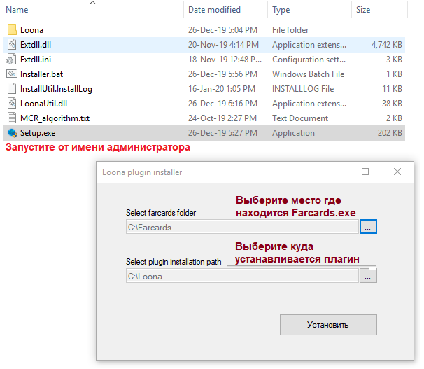

- После установки зайдите в Windows -> Services (Сервисы), найдите Loona r-keeper plugin и убедитесь что «Startup Type» стоит автоматичекий (Automatic)

 

- Не закрывайте окно сервисов

- В папке с плагином также для вашего удобства содержится FARCARDS со всеми необходимыми настройками. Если имеется FARCARDS, можно настроить его вручную. (Настройки ниже)

### Настройки FARCARDS

-	Скопируйте «Extdll.dll» и «Extdll.ini» в папку UCS/FARCARDS
 
 

-	Откройте файл «FARCARDS.INI» в текстовом редакторе

-	В поле DLL впишите «ExtDll.dll» и сохраните изменения
 
 

-	Запустите  «Farcards.exe – install»

## Создание MCR алгоритма

-	Откройте папку где содержится R-keeper и запустите R-keeper «Manager»
 
 

-   Далее, откройте r_keeper менеджер и пройдите в ***Сервисы -> Обработка Сигналов Устройств -> MCR алгоритмы***

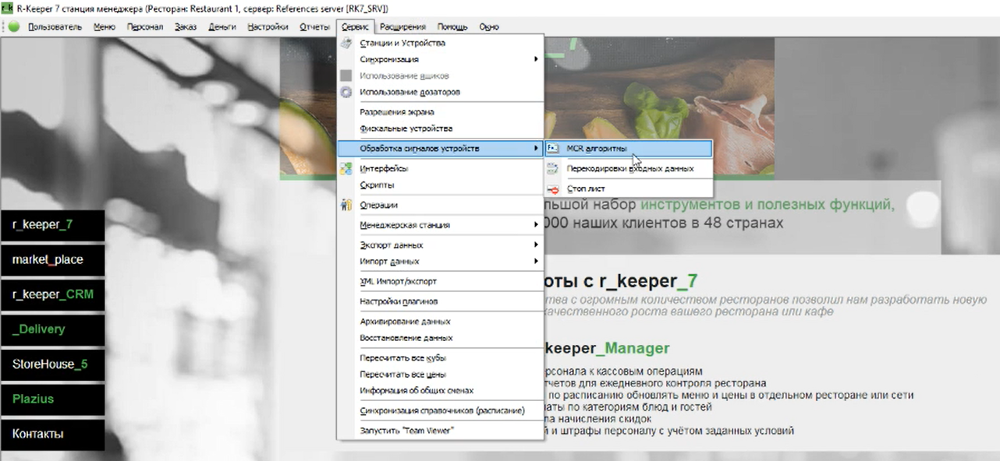 

-   Откроется страничка существующих алгоритмов. Убедитесь что у вас имеется алгоритм loona.

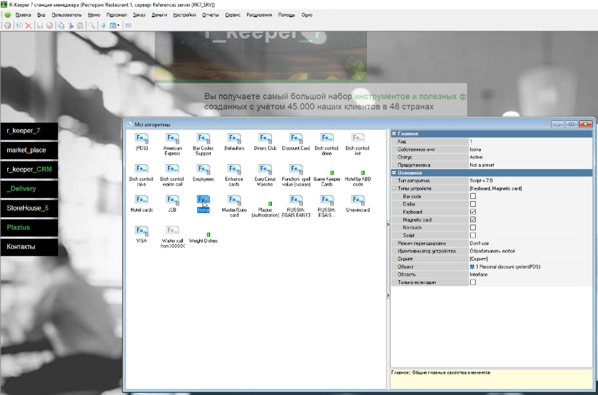 

-   Создайте новый алгоритм для элекртонных карт

-   Для создания нового алгоритма можно просто скопировать любой имеющийся алгоритм и вставить его в окно алгоритмов. 

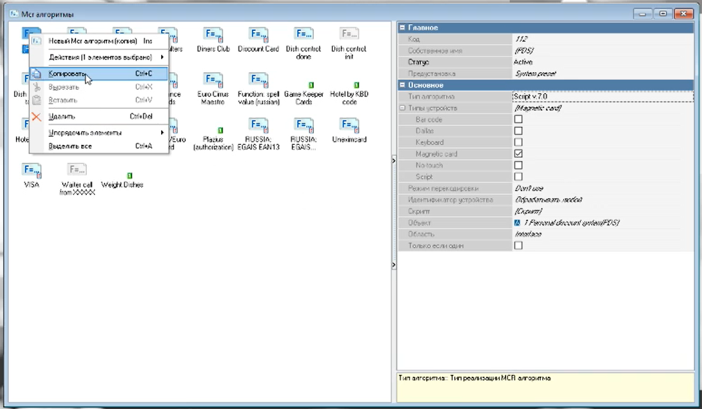 

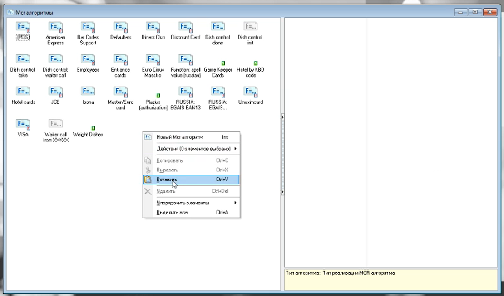 

-   После этого переименуйте скопированый алгоритм на **loona**.

-   Нажмите на алгоритм и откроются свойства справа, поменяйте статус на **Active** и затем убедитесь что все настройки совпадают с настройками представленными ниже:

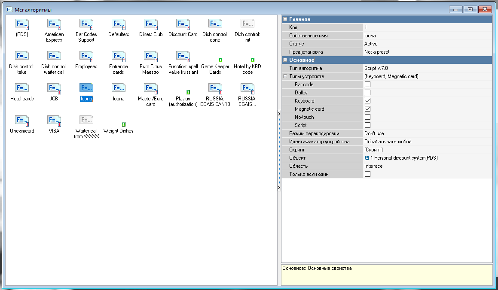 

-   Нажмите на скрипт, и откройте окно скрипта с помощью иконки слева.

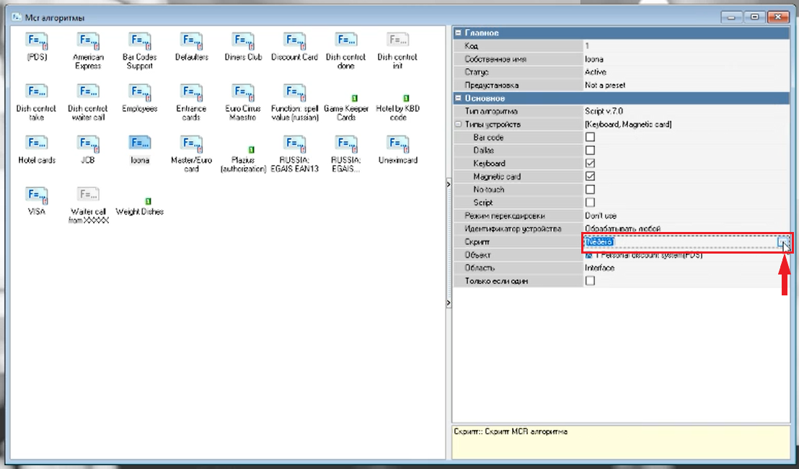 

-   В окне скрипта замените имеющийся скрипт на код расположенный ниже:

<pre><code>
function MCR1000028(DeviceSignal: Integer; DeviceIdent: Integer; var Parameter: String): Boolean;
var enc: integer; id, ratio, couponeCode :integer; 
var encShift, couponCodeShift :integer;
var couponSeparateSymbol :String;        
var idString:String;
var cardCodeResult:Int64;
begin 
 
  Result:=false;           
  ratio :=1000; 
  encShift :=48;
  couponCodeShift:=36;
  couponSeparateSymbol := '/';    
  if pos('-', Parameter) > 1 then begin
        Enc := StrToIntDef(copy(Parameter, 1, pos('-', Parameter) - 1),-1);
        if Enc>0 then begin
          idString := copy(Parameter, pos('-', Parameter)+1, length(Parameter));
          
          if pos(couponSeparateSymbol, idString) > 1 then begin
            couponeCode := StrToIntDef(copy(idString, pos(couponSeparateSymbol, idString)+1, length(idString)),-1);
            idString :=   copy(idString, 1, pos(couponSeparateSymbol, idString) - 1)       
          end; 
          id :=  StrToIntDef(idString,-1);
          cardCodeResult :=     (enc shl encShift ) and (StrToInt64('0x7FFF')shl encShift);
          cardCodeResult :=    cardCodeResult or ((couponeCode shl couponCodeShift) and (StrToInt64('0xFFF')shl couponCodeShift) ) ;
          cardCodeResult :=    cardCodeResult or id;
          Parameter :=Int64ToStr(cardCodeResult);
          Result:=true;     
        end;  
  end;       
end;
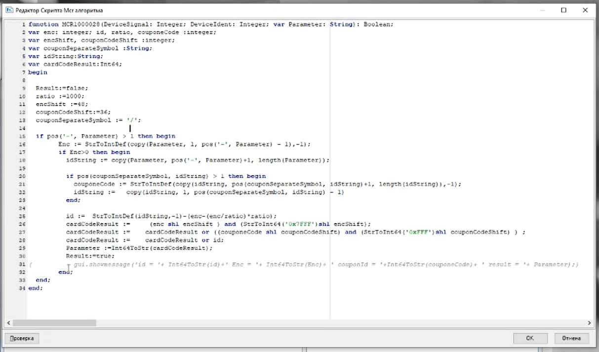 
</code></pre>

- Нажмите "Ок" и закройте окно

## Настройка PDS

В настройку PDS входит:

- Создание PDS интерфейса

- Создание и настройка кассового сервера (устройство)

- Создание валюты для оплаты с PDS (не обязательно для скидкочной лояльности)

- Введение интерфейсов PDS FARCARDS.ini и TMS.ini (при необходимости и наличии мобильного официанта)

- Введение интефейса в MCR алгоритм

Натройка:

- В r_keeper менеджере и пройдите в **Сервис -> Интерфейсы**
 
 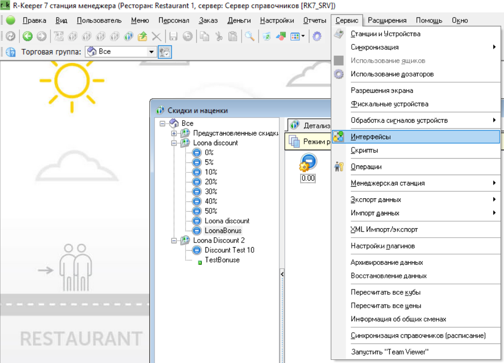

- В открывшемся окне создайте новый PDS (или можно настроить имеющийся), и введите данные как показано ниже

 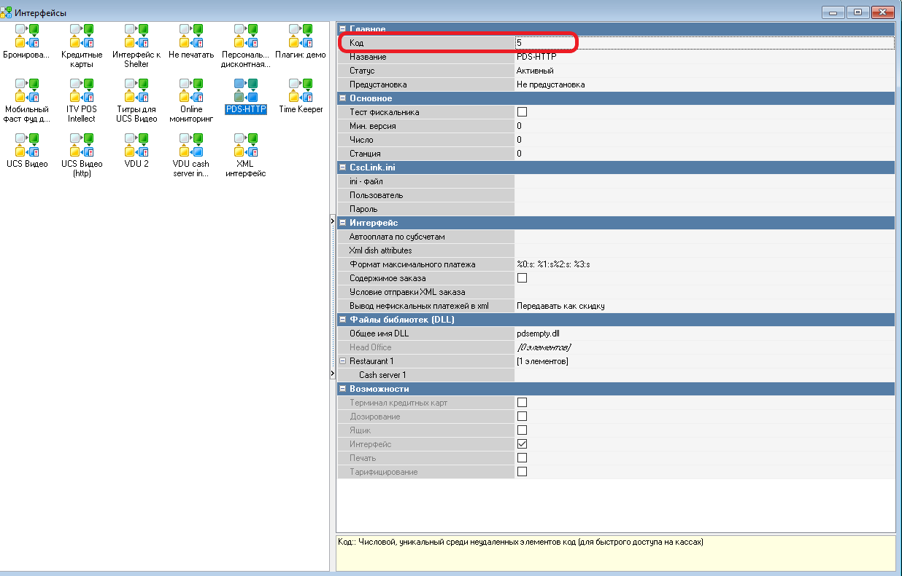

- Далее, нужно создать кассовый сервер (устройство) и валюту PDS

- Пройдите в **Сервис -> Стаанции и Устройства**, откройте Cash Server вашего ресторана и создайте "устройство" с PDS интерфейсом.

- В поле PDS Server Name введите название вашего интерфейса как показано ниже

- Выберите "Yes" на **Pass ALL Reciepts XML data** и **Pass ALL Bills XML data**

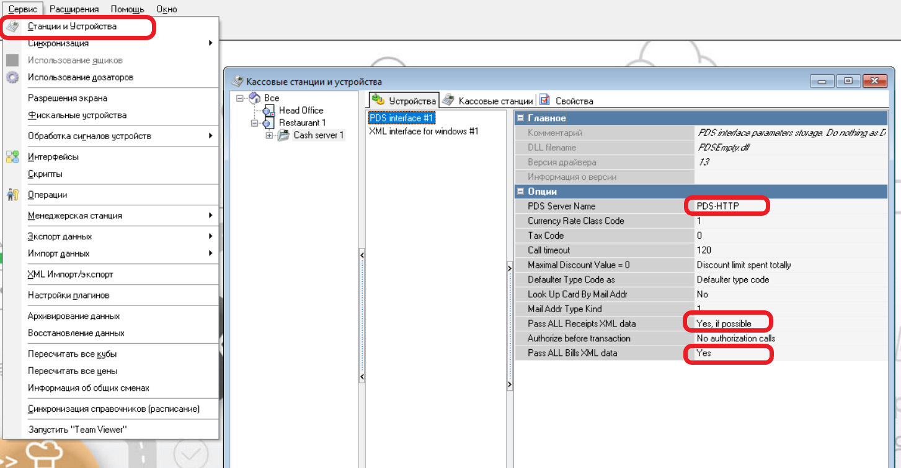

- Далее, для создания валюты пройдите в **Деньги->Валюты**

- В разделе оплаты картами создайте PDS оплату

- В поле максимальный процент введите 100.00

- В интерфейсе введите свой PDS интерфейс

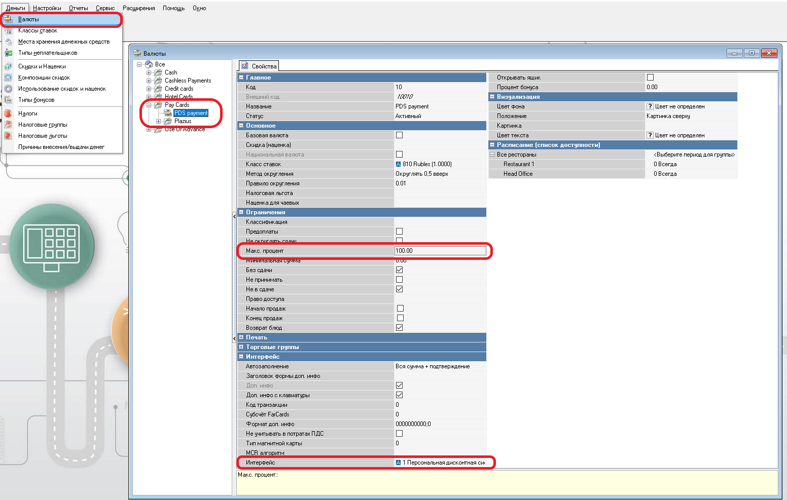

- Далее, введите данные о PDS интерфейсе в FARCARDS и TMS
 
- Убедитесь что значение в поле **Код** записано в файлах TMS.ini и FARCARDS.ini:
    
    - в файле TMS.ini пройдите в р аздел [CARDDATA] и поменяйте значение Interface на Interface = (введите значение *Кода*)
    
    - далее, в том же файле дайте то же значение для Interface в разделе [RTGI] как показано ниже
    
    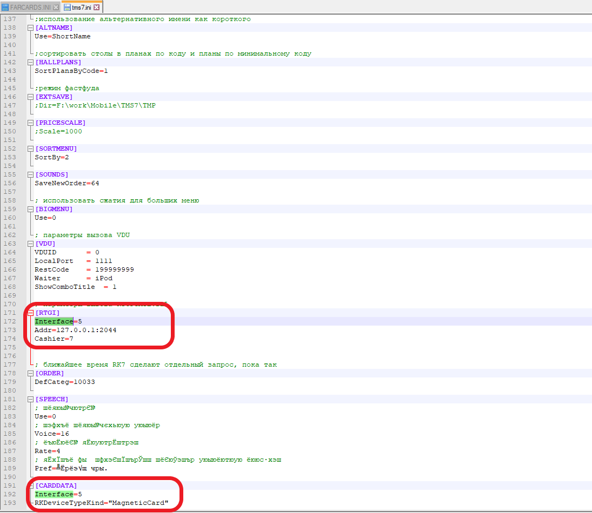  

- Убедитесь что название созданой PDS совпадает с названием указаным в FARCARDS.ini
 
    - в файле FARCARDS.ini пройдите в раздел [pds_netk] и поменяйте значение NetServerName на NetServerName = (введите название PDS)
    
    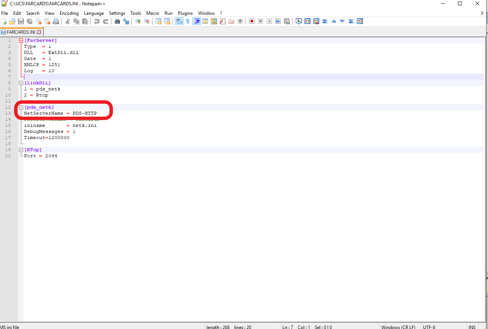
    
    *имейте ввиду, что поочередность введения данных в файлах имеет значение. Например в TMS.ini CARDDATA сначала впишите Interface, а затем RKDeviceTypeKind.
    
    *При возникновении проблем при проведении транзакции, проверьте PDS_netk.log и удестоверьтесь что на FARCARDS запросы приходят справильного интерфейса. Запросы могут приходить с предустановленного интерфейса, в этом случае можно* **выключить предустановленный интерфейс**
    
- Далее, зайдите в созданый вами MCR алгоритм и выберите созданый PDS в поле "Обьект"

    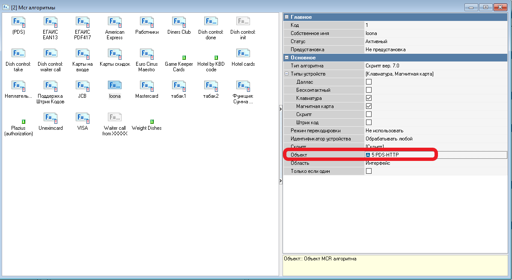
    
## Создание Бонуса или Подарочного сертификата

-	Зайдите в r_keeper менеджер

-   Пройдите в типы бонусов

-   Создайте новый бонус и назовите его **LoonaBonus**

-	Пройдите в меню в раздел «Деньги» и откройте «Скидки и Наценки»
 
 

-	Откроется окно управления скидок и наценок, наведите мышь на поле «All» и с помощью правой кнопки мышки создайте новый тип скидок
 
 

-	Откроются «Свойства», в них введите Название своей скидки и поменяйте статус на Активный
 
 

-	Пройдите в окно «Скидки/Нацинки» и создайте новую скидку (Нажмите правой кнопки мышки на свободое поле, из возникших опций выберите «Новая скидка»)
 
 

-	Введите название вашей лояльности, пока что не меняйте статус на активный
 
 

-	Откройте детализацию вашей лояльности двойным кликом на иконку
 
 

-	Создайте новую детализацию (Нажмите правой кнопки мышки на свободое поле, из возникших опций выберите «Новая детализация»)
 
 

-	Откройте поле настроек детализации, и укажите "тип бонуса": **LoonaBonus**
 
 

-	Сохраните изменения 

 

-	Пройдите обранто в «Свойства» вашей скидки и поменяйте статус на активный «Active»

 

-	Сохраните изменения, но еще не закрывайте окно «Скидки и Надбавки»

## Создание Скидки

-	Откройте систему r_keeper и зайдите в неё

-	Пройдите в меню в раздел «Деньги» и откройте «Скидки и Наценки»
 
 

-	Откроется окно управления скидок и наценок, наведите мышь на поле «All» и с помощью правой кнопки мышки создайте новый тип скидок
 
 

-	Откроются «Свойства», в них введите Название своей скидки и поменяйте статус на Активный
 
 

-	Пройдите в окно «Скидки/Нацинки» вашей новой скидки и создайте новую скидку (Нажмите правой кнопки мышки на свободое поле, из возникших опций выберите «Новая скидка»)
 
 

-	Введите название вашей скидки, пока что не меняйте статус на активный
 
 

-	Откройте детализацию вашей скидки двойным кликом на иконку
 
 

-	Создайте новую детализацию (Нажмите правой кнопки мышки на свободое поле, из возникших опций выберите «Новая детализация»)
 
 

-	Откройте поле настроек детализации, и поменяйте процент скидки на проценты скидок настроеные в кабинете
 
 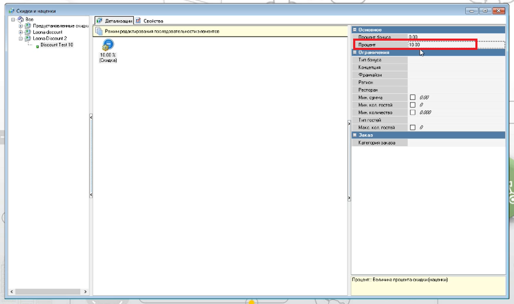

-	Сохраните изменения 

 

-	Пройдите обранто в «Свойства» вашей скидки и поменяйте статус на активный «Active»

 

- **Повторите все пункты по созданию новой детализации для каждого уровня скидок имеющихся в вашем кабинете**

-	Сохраните изменения, но еще не закрывайте окно «Скидки и Надбавки»

## Создание Купона

Для создания купона пройдите все пункты для создания скидки, но измените указаный процент скидки на 100%.

## Необходимые Настройки в офисе и плагине

-	Откройте ваш браузер и пройдите по адресу: «localhost:1234/settings»

-	Откроется поле настроек плагина. 

- Задаем настройки:
   - Api access token - доступен после создания сканера в кабинете (подробнее в разделе настройки кабинета) или по запросу от поддержки компании Loona
   - Api base url - https://api.loona.ai  
   - Plugin url - http://localhost  
   - Waiter port - 1234
   - Update URL - https://storage.yandexcloud.net/loona-common/loona-plugin/
   - Loona Plugin Path - папка в которой установлен плагин Loona
   - Farcards Path - папка в которой находится Farcards.exe
  
- Далее, Введите необходимые параметры для настройки скидки и сохраните параметры. Код вашей скидки, бонуса или купона вам доступен в свойствах скидки в r_keeper manager.

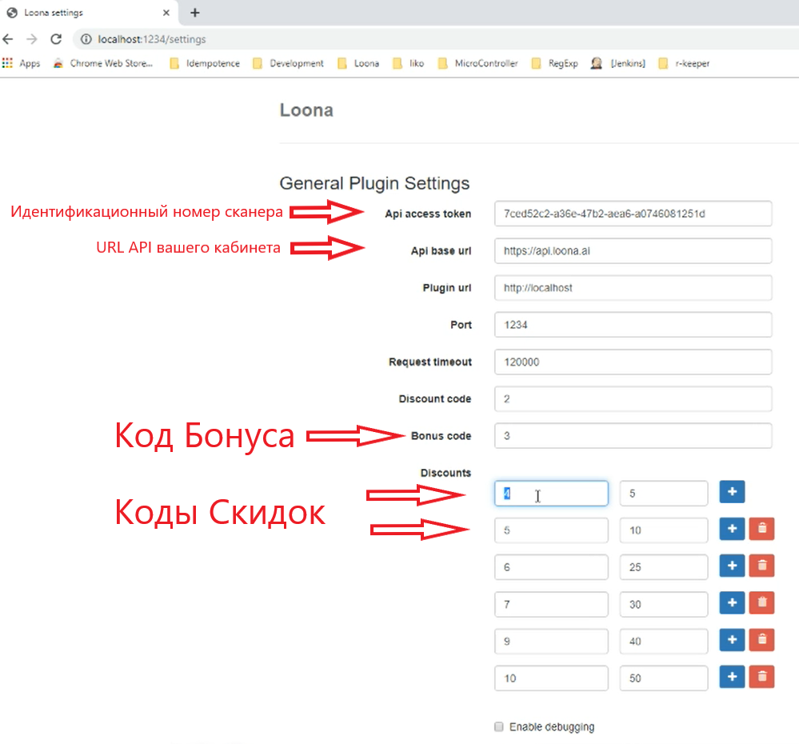 

-	Сохраните изменения параметров плагина

-	Вернитесь в «Сервисы», выделите сервис Loona r-keeper plugin, обновите сервис (сервис должен выключится после обновления), затем запустите сервис

 

## Настройки в кабинете

### Редактирование макета:

**Для использования скидок, бонусов и подарочных сертификатов** в системе r_keeper штрихкод на карте должен содержать Номер Карты. Для настройки штрихкода на Номер Карты:

- Зайдите в ваш личный кабинет Loona

- Перейдите в раздел **Макеты**

- Зайдите в  **редактирование** того макета на который хотите настроить сканер

- Перейдите в секцию **Дизайн**

- Нажмите на штрихкод, в настройках поля откроются настройки штрихкода

- Поменяйте тип штрихкода на QR

- Поменяйте значение на **Номер Карты**

**Для использования купона:**

- В значении штрихкода поменять значение на “своё значение”

- Поменять своё значение на ${pid}/№Продукт, где “№Продукт” это номер под которым позиция (блюдо) зарегистрирована в iikoOffice.

- Использовать карты Loona

## Создание API Token сканера для карты

Для иинтеграции с r_keeper вам необходимо создать сканер в кабинете Loona и использовать его токен доступа. 

Для создания нового сканера:

- Зайдите в ваш личный кабинет Loona

- В разделе Сканер нажмите на Создать сканер.

- Введите название нового сканера

- Выберите тип сканера - "App".

- Выберите макеты с картами которые предназначены для сканирования, или отметьте Получить полный доступ чтобы сканер работал со всеми вашими макетами.

- Нажмите Создать

В списке созданных сканеров появится новый сканер со своим **Идентификационным номером**, этот номер используется при настройке плагина.
 
