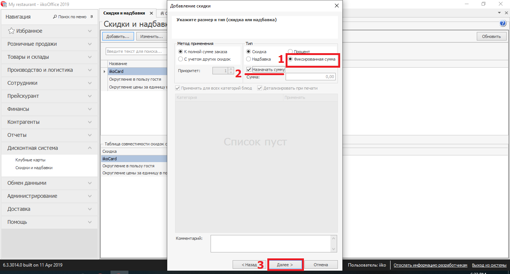

# iiko
## Установка плагина
- Копируем папку LoonaPluginSettings в C:\Users\YourUserName\ProgramData\Roaming 

- Копируем папки LoonaPlugin и iikoWaiter5 в директорию iikoFront/Plugins (в нашем случае C:\Program Files\iiko\iikoRMS\Front.Net\Plugins)

- Запускаем iiko Front (помним что для данного метода нужна лицензии типа iikoTableService, iikoWaiter, iikoFrontPaymentPlugin)

- В iiko Front переходим в раздел “Дополнения” и выбираем “Loona settings”.

        login - Admin 

        password - Loona Admin

- Задаем настройки
        
        Api access token - по запросу
        Api base url - https://apidev.loona.ai
        Waiter request url - http://localhost
        Waiter port - 1234

- Открываем iiko Office
    - Переходим в раздел Дисконтная Система -> Скидки и Надбавки
    - Добавляем скидку
    - Обязательно пишем название - LoonaFixedSumDiscount
    - Тип скидки ставим Скидки и Надбавки
    - Нажимаем Далее
    

- Убираем галочку Можно назначить вручную, остальное по усмотрению ресторана

- Тип ставим “Фиксированная сумма” и обязательно устанавливаем галочку “Назначать сумму”

- Нажимаем Далее и заканчиваем установку скидки.

- Добавляем внешний вид оплаты. Переходим в раздел “Розничные продажи”  нажимаем на “Тип платы” и добавляем новую оплату. 
- Обязательно указываем: 

        наименование - Loona Payment
        Тип - Внешний тип оплаты
        Название в чеке - пишите что хотите
        Безналичный тип - Loona Payment 
- Сохраняем

- Устанавливаем мобильное приложение iikoWaiter5

- Перезагружаем iiko front
