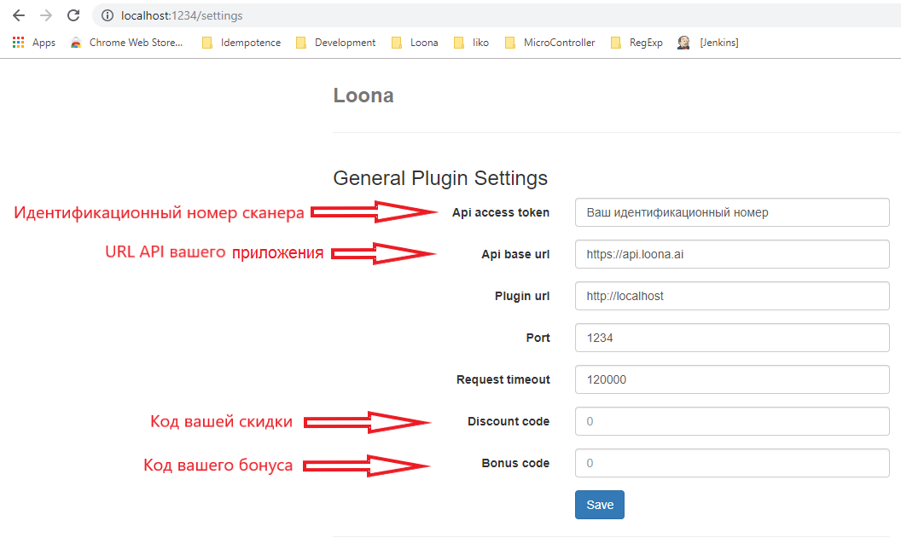

# iiko
## Установка плагина
- Копируем папку LoonaPluginSettings в C:\Users\YourUserName\ProgramData\Roaming 

- Копируем папки LoonaPlugin и iikoWaiter5 в директорию iikoFront/Plugins (в нашем случае C:\Program Files\iiko\iikoRMS\Front.Net\Plugins)

- Запускаем iiko Front (помним что для данного метода нужна лицензии типа iikoTableService, iikoWaiter, iikoFrontPaymentPlugin)

- В iiko Front переходим в раздел “Дополнения” и выбираем “Loona settings”.

   > Login - Admin   
   Password - Loona Admin

- Задаем настройки
        
 >  Api access token - по запросу  
    Api base url - https://apidev.loona.ai  
    Waiter request url - http://localhost  
    Waiter port - 1234
>

- Открываем iiko Office
    - Переходим в раздел Дисконтная Система -> Скидки и Надбавки
    - Добавляем скидку
    - Обязательно пишем название - LoonaFixedSumDiscount
    - Тип скидки ставим Скидки и Надбавки
    - Нажимаем Далее
    

- Убираем галочку Можно назначить вручную, остальное по усмотрению ресторана

- Тип ставим “Фиксированная сумма” и обязательно устанавливаем галочку “Назначать сумму”

- Нажимаем Далее и заканчиваем установку скидки.

- Добавляем внешний вид оплаты. Переходим в раздел “Розничные продажи”  нажимаем на “Тип платы” и добавляем новую оплату. 
- Обязательно указываем: 

    >   Наименование - Loona Payment  
        Тип - Внешний тип оплаты  
        Название в чеке - пишите что хотите  
        Безналичный тип - Loona Payment
- Сохраняем

- Устанавливаем мобильное приложение iikoWaiter5

- Перезагружаем iiko front

## Настройки в кабинете

# r_keeper

## Установка плагина

*В течении использования плагина, нужно выключить Windows Firewall или открыть доступ для порта плагина (port 1234)

-	Скачайте папку Loona R-keeper

-	Откройте папку Loona R-keeper

 

-	Скопируйте «Extdll.dll» и «Extdll.ini» в папку UCS/FARCARDS
 
 

-	Откройте файл «FARCARDS.INI» в текстовом редакторе

-	В поле DLL впишите «ExtDll.dll» и сохраните изменения
 
 

-	Запустите  «Farcards.exe – install»

-	Откройте папку где содержится R-keeper и запустите R-keeper «Manager»
 
 

-	Откройте систему r_keeper и зайдите в неё

-	Пройдите в меню в раздел «Деньги» и откройте «Скидки и Наценки»
 
 

-	Откроется окно управления скидок и наценок, наведите мышь на поле «All» и с помощью правой кнопки мышки создайте новый тип скидок
 
 

-	Откроются «Свойства», в них введите Название своей скидки и поменяйте статус на Активный
 
 

-	Пройдите в окно «Скидки/Нацинки» вашей новой скидки и создайте новую скидку (Нажмите правой кнопки мышки на свободое поле, из возникших опций выберите «Новая скидка»)
 
 

-	Введите название вашей скидки, пока что не меняйте статус на активный
 
 

-	Откройте детализацию вашей скидки двойным кликом на иконку
 
 

-	Создайте новую детализацию (Нажмите правой кнопки мышки на свободое поле, из возникших опций выберите «Новая детализация»)
 
 

-	Откройте поле настроек детализации, и поменяйте процент скидки на 100.00
 
 

-	Сохраните изменения 

-	Пройдите обранто в «Свойства» вашей скидки и поменяйте статус на активный «Active»

 

-	Сохраните изменения, но еще не закрывайте окно «Скидки и Надбавки»

-	Откройте папку Loona R-keeper

-	Скопируйте папку Loona в папку где хратится r_keeper и FARCARDS

 

-	Откройте скопированую папку Loona, и запустите из нее файл «ServiceInstaller.exe» как администратор

 

-	Сервис будет установлен, после установки зайдите в Windows  Services (Сервисы), найдите Loona r-keeper plugin и убедитесь что «Startup Type» стоит автоматичекий (Automatic)

 

-	Не закрывайте окно сервисов

-	Затем откройте ваш браузер

-	Введите адрес плагина в браузере, адрес: «localhost:1234/settings»

-	Откроется поле настроек плагина. Введите необходимые параметры для настройки скидки и сохраните параметры. Код вашей скидки вам доступен в свойствах скидки в r_keeper manager.

 

> Для получения Идентификационного номера сканера и URL кабинета обратитесь к документации кабинета Loona  

> При изменениях порта на «XXXX», адрес плагина меняется на localhost:XXXX/settings (но нет необходимости менять порт)  

-	Сохраните изменения параметров плагина

-	Вернитесь в «Сервисы», выделите сервис Loona r-keeper plugin, обновите сервис (сервис должен выключится после обновления), затем запустите сервис

 

