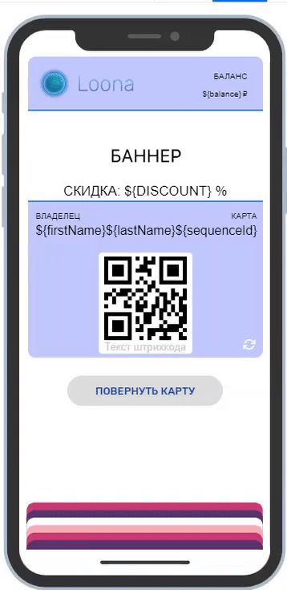
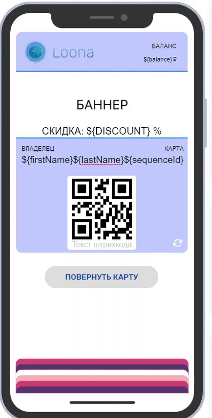
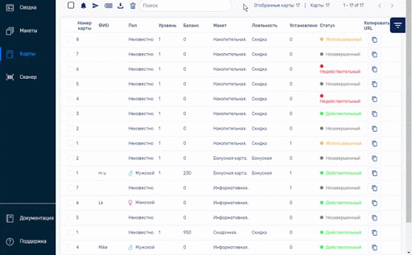
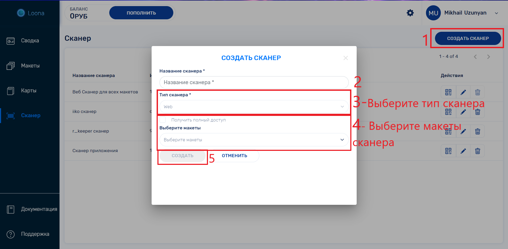

# Макеты
В разделе макеты создаются и редактируются макеты карт. 

На основе макета карт настраивается система лояльности и создаются персонализированные карты для пользователей.

### Создание нового макета
Пройдя в раздел **Макеты** и нажав **Создать Макет** откроется страница создания макета. Для создания макета необходимо: 

Заполнить обязательные поля: название макета, первичное описание макета и тип бизнеса.

Выбрать тип программы лояльности ваших карт, подходящий вашему бизнесу и выбрать стиль карты подходящий вашему корпоративному стилю. Более детальные изменения дизайна доступны в **редакторе**. Тип системы лояльности макета в дальнейшем не может быть изменен в макете.

Добавить иконку вашего макета, она будет высвечиваться в уведомлениях у пользователей. 

Выбрать сертификат которым вы будете пользоваться. Сертификат можно загрузить в личном кабинете, **настройки -> сертификат**. (insert линк к загрузке и созданию сертификата)

## Редактирование

### Редактирование информации и дизайна макета

Детальное редактирование макета доступно в разделе **Макеты ->  Редактировать -> Дизайн**. 

В разделе **Дизайн** доступны изменения в баннере, лого, цветах карт, и информации на лицевой и оборотной сторонах.
Добавляйте информацию непосредственно на макете карты.

Для **добавления переменных** на лицевую или оборотную сторону карты используйте «@» непосредственно в информационном поле и выберите переменную из представленных опций. Так на карты можно добавлять персонализированные данные полученные из регистрационной формы и информацию из системы лояльности.

При выборе информационного поля открываются настройки поля, отличающиеся при разных полях и типах карт. В настройках поля можно настроить формат, ввести текст уведомления при изменениях в переменных, и выравнивать текст.

В настройках поля штрихкода возможно настроить тип штрихкода и его значение (при наличии **мобильного сканера** (link to mobile scanner) рекомендуется выбрать опцию «URL сканера»).

### Настройки и добавление переменных 

Уникальные данные каждой карты сохраняются в переменных (**Макеты ->  Редактировать -> Переменные**). В кабинете есть предустановленные стандартные переменные, дополнительные переменные могут быть добавлены нажав на **добавить переменную**.

При добавлении переменных, необходимо выбрать тип переменной. При выборе типов **текст, число или дата** вы можете установить значение по умолчанию. *insert screen here*

При выборе типа **список**, вводите значения через запятую. В регистрационной форме список будет отображаться как выпадающее меню. При наличии переменной в **дизайне** карты пользователя, будет отображаться выбранное им значение после заполнения регистрационной формы.

Переменные могут быть использованы при заполнении содержимого карты, а также регистрационной формы.

Данные переменных доступны для просмотра и обработки в разделе **карты**.

### Регистрационная форма

В разделе **Макеты ->  Редактировать -> Регистрационная форма** вам доступно создание и редактирование регистрационной формы.

Вы можете редактировать страницу регистрации: изменять фон, текст и цвет кнопок, также можно загрузить лого компании.

В регистрационную форму могут быть включены переменные из добавленных и стандартных переменных, с опцией сделать поле **обязательным полем**. Отбирайте поля из доступных переменных с помощью  флажка.

Выбор этапа регистрации пользователей позволяет определить будет ли пользователь регистрироваться вовсе, регистрироваться до или после скачивания карты.

В случае если выбрана опция регистрации пользователей после скачивания карты, рекомендуется иметь URL регистрационной формы на карте. Данный URL может быть добавлен вбивая «@» и выбрав переменную «registrationUrl».

### Геолокация и гео-уведомления

Выбор геолокации и отправка гео-уведомлений доступны в разделе **Макеты ->Редактировать -> Геолокация**.

Для отправки гео-уведомлений выберите местоположение (до 10 локаций) в радиусе действия которого владелец карты будет получать PUSH-уведомление. Точку можно установить, набрав адрес в поисковой строке или выбрав место на карте с помощью правой кнопки мыши. 

### Установка ограничений

Ограничивать нежеланное  распространение карт можно в разделе **Макеты ->  Редактировать -> Ограничения**. 

В случае если вы хотите что бы одна карта была только на одном устройстве, можно ограничить совместное использование карты. Для этого отметьте  флажком ”Разрешить только одному устройству загружать карту”. 

Разные сценарии действий могут быть имплементированы случае если пользователь, который ранее создавал карту, повторно проходит по URL-адресу:

Опция “Создать новую карту” добавляет новую карту без предыдущих данных в электронный кошелек пользователя

Опция “Перенаправить на существующую карту” открывает добавленную карту в приложении кошелька

Опция “Разрешить пользователю выбрать” даёт пользователю выбрать из двух предыдущих опций

Конечным пользователям карт можно давать доступ к распространению карт, вид распространения можно выбрать в пункте “Способ поделиться картой”:

Опция “Поделиться ссылкой на макет” позволяет пользователю отправлять ссылку на макет другим пользователям которые смогут создать себе новую карту

Опция “Разрешить делиться картой” позволяет пользователю отправлять свою карту другим устройствам, данные сохраненные в карте останутся и на новом устройстве

Опция “Запретить делиться картой” лишает пользователей доступа к распространению
*Рекомендации: какие ограничения лучше иметь каким бизнесам?*
Хороший вопрос. Зависит от позиции бизнеса и сегмента  

### Настройки системы лояльности

Настройки системы лояльности доступны в разделе **Макеты ->  Редактировать -> Лояльность**.
 
Раздел Лояльность доступен в типах макетов **Бонусная** и **Скидка**.

Процент скидки или накоплений можно менять в разделе “Уровни”. Если в разделе “Уровни” добавить уровни, можно указать пороговое значение общей суммы покупок клиента, при достижении которых, он автоматически перейдет на другой уровень с более высоким процентом скидки.

В случае бонусной (накопительной), можно добавить максимально возможный процент оплаты чека бонусами и приветственный бонус, который поступит на накопительный счет при активации карты. 

## Профиль Макета

Перейти в профиль макета можно нажав на изображение макета. В профиле макета доступно генерирование QR, ссылок распространения, UTM, история добавленных карт, история транзакций и тд.

В разделе «Недавние карты» в профиле макета сохраняются серийный номер, дата создания и статус недавно добавленных карт. Более подробная информация доступна в профиле карты (линк).

В разделе «Транзакции» в профиле макета сохраняются данные о транзакциях карт данного макета.

### QR и URL ссылки

При открытии раздела **Макеты ->  Распространение** в правом верхнем углу можно увидеть QR код для распространения карт, её возможно  скачать или скопировать нажатием правой кнопки мыши․

Tам же, при нажатии на «копировать URL», URL ссылка для распространения будет скопирована. 

### Создание карт администратором

Карты могут быть созданы самостоятельно администратором.

Для самостоятельного создания карты пройдите в раздел **Макеты ->  Распространение**, затем нажмите на **Создать**. Карта будет создана автоматически и откроется профиль созданной карты. (линк к профилю карты)

### UTM-метки и отслеживание эффективности методов распространения

UTM-метки позволяют создавать отличающиеся ссылки для разных методов распространения карт, этот инструмент помогает определять данные об источнике трафика. Это позволяет бизнесу сегментировать пользователей по определенному типу и поведению, анализировать эффективность и конверсию трафика рекламного канала.

При нажатии на «Создать UTM» откроется окно для заполнения информации на метке. Заполните поля так, чтобы было легко различать источники трафика. 

Созданные метки будут отображаться в таблице в нижней части страницы, где можно скопировать уникальную ссылку, а также увидеть информацию о конверсии, количество установленных карт и посетителей.

## Карты

В этом разделе вам доступна работа с картами и их информацией, а также отправка индивидуальных и массовых PUSH-уведомлений.

### Фильтрация и поиск

С помощью  **фильтрации** ( в правом верхнем углу) можно сортировать и отбирать карты по их статусу, стилю, макету, полу пользователя, датам и тд.

С помощью поисковой строки можно найти определённые карты содержащие данные, совпадающие с поисковым запросом.

### Скачивать и делиться данными

Отбирать определенные карты и группы карт можно с помощью  флажка.

Наборы данных клиентских карт можно **скачивать**  и  **поделиться** картами для дальнейшей обработки данных.

###Профиль и редактирование карты

Профиль карты открывается при нажатии на ту или иную карту в разделе **Карты**, а также при создании карты самостоятельно администратором.

В профиле карты высвечивается лицевая сторона карты, с той же информацией которая доступна пользователю.

С помощью внутреннего редактирования карты в секции **Профиль** можно менять статусы карт, уровень схемы лояльности и поделиться картой.

В секции **Данные** доступны сохраненные данные заполненные при регистрации пользователем. Там же данные пользователя можно менять и обновлять в ручную.

В секции **История сканера** можно просмотреть полную историю сканера и обновления балансов карты.

### Отправка PUSH-уведомлений

Отобранным пользователям можно отправлять PUSH-уведомления.
Для отправки PUSH-уведомления:

- Перейдите в раздел **Карты**

- **Отметьте**  карты пользователей которым хотите отправить уведомление

- Нажмите **отправить push-уведомление** 

- Вбейте в текстовую строку желаемый для отправки текст

- Нажмите **отправить**

#Сканер

## Использование веб-сканера Loona

Для использования веб-сканера Loona, штрихкод на карте должен содержать URL сканера. Для настройки штрихкода на URL ссылки:

- Перейдите в раздел **Макеты**

- Зайдите в  **редактирование** того макета на который хотите настроить сканер

- Перейдите в секцию **Дизайн**

- Нажмите на штрихкод, в настройках поля откроются настройки штрихкода

- Поменяйте значение на **URL сканера**

- Далее, нужно **создать сканер** для данного макета, если у него еще нет своего сканера.  (Для создания сканера, пройдите в раздел документации создания сканера)

Использование сканера:

- Откройте QR или штрихкод сканер на смартфоне или камеру смартфона (на обновленных версиях в iPhone и Android сканирование возможно с помощью приложения камеры)

- Наведите камеру смартфона на QR код или штрихкод для сканирования

- После сканирования появится URL ссылка, пройдите по ссылке

- Введите Пин-код данного сканера

- Введите сумму покупки

- В случае **скидочной** карты обновленная сумма к выплате будет высчитываться автоматически и транзакция будет сохранена в системе Loona 

- В случае **бонусной** карты при введении суммы оплаты обновляется накопительная сумма кешбэка. На той же странице также можно вычесть накопленную сумму кешбэка. При введении суммы вычета, сумма к выплате обновляется, производится оплата, после чего данные карты обновляются автоматически и транзакция сохраняется в системе Loona

- В случае **купона** вам надо активировать купон (статус карты меняется с *Незавершенный* на *Действительный*). Далее надо отсканировать купон повторно, и появится опция использовать купон. После использования, купон деактивируется (статус карты меняется с *Действительный* на *Использованный*) и штрихкод пропадает с карты.

## Использование сторонних систем и приложений

Для использования сторонних систем и приложений (которые **интегрированы** с кабинетом Loona) вам необходимо ввести идентификационный номер (API access token) в систему и штрихкод на макете должен содержать соответствующую информацию. 

Для получения идентификационного номера при **создании сканера** нужно выбрать тип сканера *App*. (Для создания сканера, пройдите в раздел документации создания сканера) В списке выберите ваш созданный сканер и скопируйте его, используйте этот номер в настройке сторонней системы. 

Для использования сторонней системы штрихкод на карте должен содержать Номер Карты. Для настройки штрихкода на Номер Карты:

- Перейдите в раздел **Макеты**

- Зайдите в  **редактирование** того макета на который хотите настроить сканер

- Перейдите в секцию **Дизайн**

- Нажмите на штрихкод, в настройках поля откроются настройки штрихкода

- Поменяйте значение на **Номер Карты**

- В случае некоторых систем, небходимо менять тип штрихкода на тот, который сканируется системой
	
Для использования купона:

- Обнаружить номер под которым продукта зарегистрирован в CRM системе

- В значении штрихкода поменять значение на “своё значение”

- Поменять своё значение на **${pid}/№Продукт**, где “№Продукт” это номер под которым продукт зарегистрирован

- Использовать карты Loona 

## Создание сканера

Для создания нового сканера:

- В разделе **Сканер** нажмите на **Создать сканер**. 

- Введите название нового сканера

- Выберите тип сканера, Web использует систему Loona для сканирования, но при наличии внешнего приложения с системой сканирования выбирайте App.

- Выберите макеты с картами которые предназначены для сканирования, или отметьте **Получить полный доступ** чтобы сканер работал со всеми вашими макетами.

- Нажмите **Создать**

Сканер со своим сгенерированным Пин-кодом будет добавлен в список сканеров. 

# Личный кабинет 
В личный кабинет можно пройти с любого места в кабинете, нажав на  настройки.

##Настройки профиля
В разделе "Профиль" доступны изменения в профиле пользователя и в профиле компании, нажав на "Редактироать" в соответствующем поле. В настройках профиля можно подписаться на нашу информационную рассылку. Так же в нижней части раздела можно удалить данный аккаунт.

## Подписка и тарифы
В разделе "Финансы" можно изменить тариф и пополнить баланс аккаунта. 

## Сертификат
В разделе "Сертификат" можно увидеть список имеющихся сертификатов и добавить новый сертификат. Для добавления нового сертификата нажмите на "Добавить" и загрузите сертификат формата .p12. 

В списке сертификата можно увидеть сроки действия сертификата, тин идентификатора сертификата и название организации, которое высвечивается над уведомлениями у прользователей карт. Для изменения названия организации нажмите на  "Редактировать".
